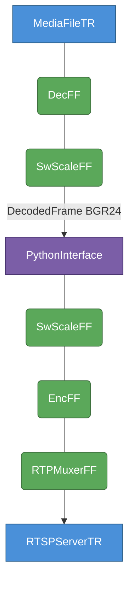
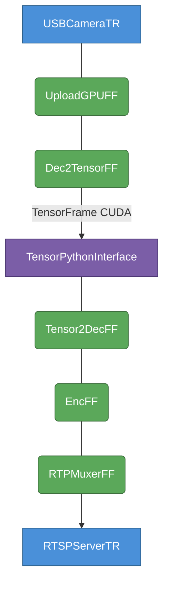
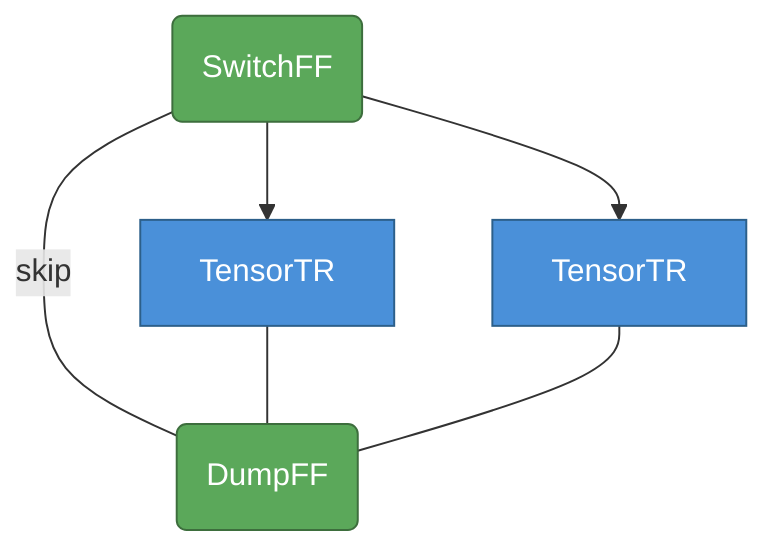
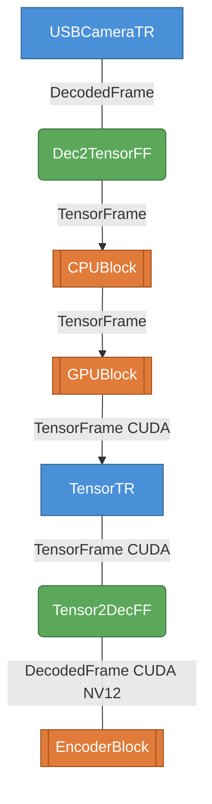
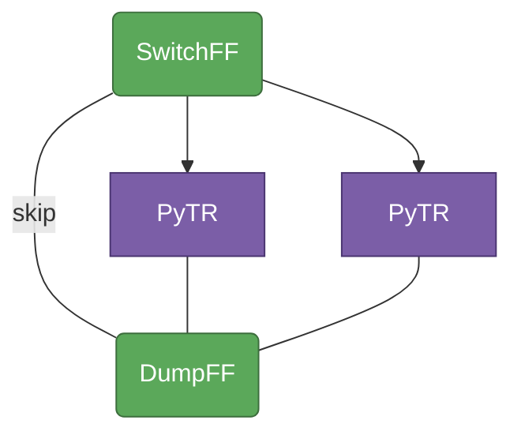
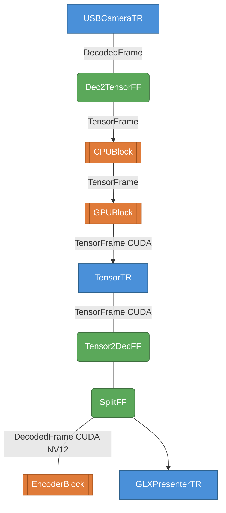

# Python Example Apps

Demo apps for complex live streaming pipelines in python:

- Stream live from USB camera
- Do preprocessing and analysis both on the CPU and GPU
- You can do image manipulation / machine vision analysis on the GPU only
- Encode stream in the GPU
- Machine vision modules can be toggled/switched on/off on-the-fly
- Visualize on your linux desktop and/or transmit your video stream over the internet with RTSP

## Setup

Install limef using the deb package, or setup your staging/development environment.

## rtsp_server.py

*Stream a media file over the internet with in-process Python frame processing*

Reads a media file, decodes it, passes frames to a Python thread via
`PythonInterface` (here: Gaussian blur via OpenCV), re-encodes, and serves the
result as an RTSP stream that any player can consume over the network.
Decoding and encoding both run on the **CPU**.  Use this as a starting point
when you want to intercept and modify frames in Python before streaming —
no GPU required.

```
python3 apps/python/rtsp_server.py --file PATH [--port 8554] [--bitrate N]
```

Connect with `ffplay rtsp://localhost:8554/live/stream`.

### Pipeline



`PythonInterface` acts as a thread boundary: frames flow in, the Python consumer
processes them (Gaussian blur via OpenCV), and pushes them back downstream.
Audio frames and `StreamFrame`s are forwarded unchanged.

---

## usb_gpu_pipeline.py

*Stream from USB camera, do GPU machine vision in Python, encode in the GPU and stream over the internet*

A practical basis for remote surveillance or any live vision application: the
camera feed is uploaded to the GPU immediately, your Python code receives frames
as CUDA tensors (via `torch.from_dlpack()`), runs inference, draws bounding
boxes, or applies any other processing entirely on the GPU, and the result is
encoded by NVENC and served as RTSP — all without the data ever touching the CPU
after the initial capture.  The demo shows a 15×15 Gaussian blur (`--modify`) as
a stand-in for real machine vision work.

```
python3 apps/python/usb_gpu_pipeline.py [--modify] [--device /dev/video0]
                                         [--width 640] [--height 480] [--fps 30]
                                         [--port 8554] [--bitrate N]
```

Connect with `ffplay rtsp://localhost:8554/live/stream`.

### Pipeline



`TensorPythonInterface` acts as a thread boundary delivering CUDA `TensorFrame`s
(shape `[C, H, W]`, `uint8`).  Access the data with `torch.from_dlpack()`, run
your model or draw into the tensor, then push a new owned `TensorFrame` back.
`Tensor2DecFF` converts back to `AV_PIX_FMT_CUDA` (NV12) for NVENC — the frame
never leaves the GPU.

> **Note:** keep frames on the GPU throughout.  If you push a CPU `TensorFrame`
> into this pipeline, `Tensor2DecFF` will output `GBRP` instead of CUDA NV12 and
> NVENC will produce incorrect colours.

---

## usb_cpu_gpu.py

*Live video processing on both CPU and GPU; processing stages can be switched and toggled on and off*

Demonstrates the `CPUBlock` / `GPUBlock` / `EncoderBlock` pattern.  Each block
wraps a `SwitchFrameFilter` with three terminals: terminal 0 is a direct
pass-through (skip), terminals 1 and 2 route through a `TensorThread` slot where
per-frame work lives.  The active branch can be switched at runtime without
stopping the pipeline — swap your CPU or GPU processing stage on the fly.
Encoding is done on the GPU with NVENC.

```
python3 apps/python/usb_cpu_gpu.py [/dev/videoN]
```

### CPUBlock / GPUBlock internals

Both blocks have the same topology; `GPUBlock` threads use `hw_accel=HWACCEL_CUDA`.



### Pipeline



---

## usb_cpu_gpu2.py

*Change machine vision module on your live stream on-the-fly, encode the modified video, visualize on your Linux desktop (you could continue by transmitting the video over the internet)*

The same `CPUBlock` / `GPUBlock` / `EncoderBlock` structure as above, but the
`TensorThread` slots inside each block are replaced with `TensorPythonInterface`
+ Python consumer threads.  This is where you put your real work: run a neural
network, draw bounding boxes, apply filters — all in Python, either on CPU
(CPUBlock) or on the GPU via `torch.from_dlpack()` (GPUBlock).  Switch between
processing modules at runtime without restarting.  After processing, a
`SplitFrameFilter` fans the result out to both a local `GLXPresenterThread` (live
window on your Linux desktop) and `EncoderBlock` for NVENC encoding and RTSP
streaming over the network.

```
python3 apps/python/usb_cpu_gpu2.py [/dev/videoN]
```

### CPUBlock / GPUBlock internals (Python threads)



### Pipeline


