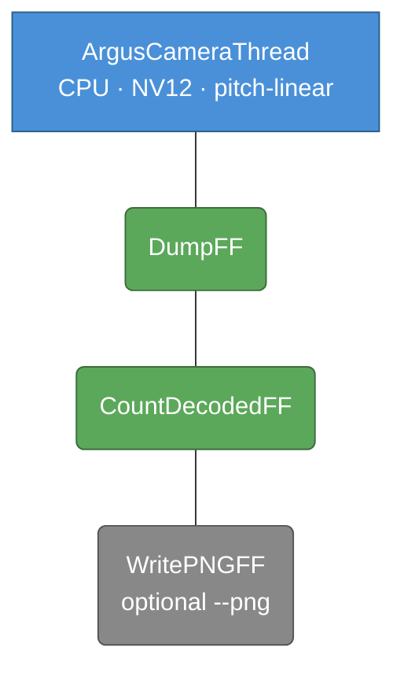
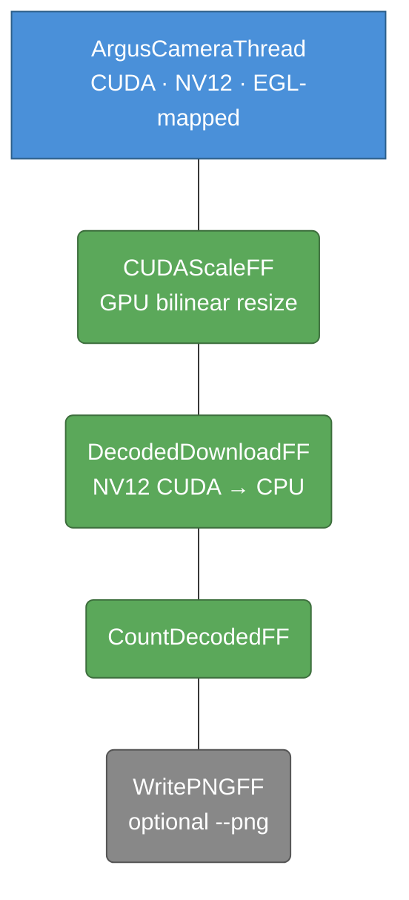
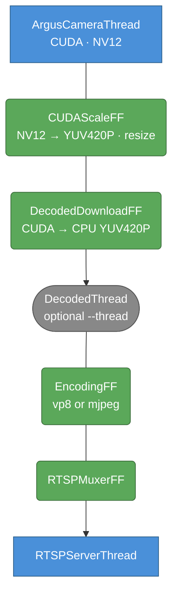
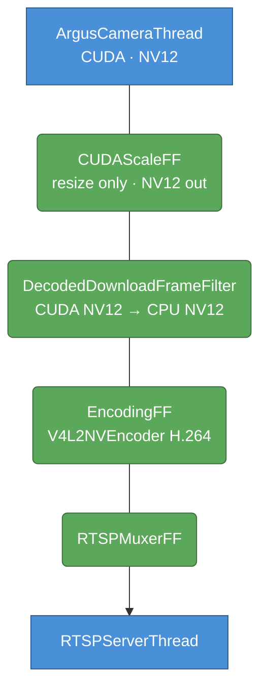
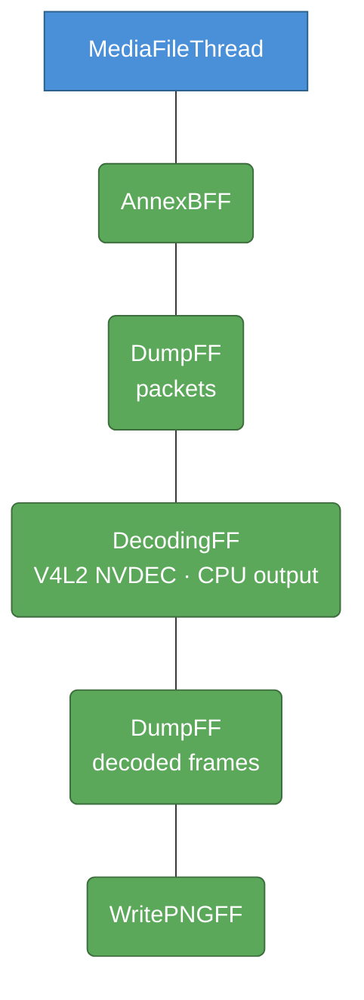
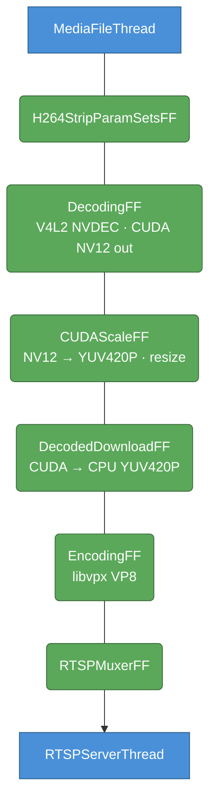
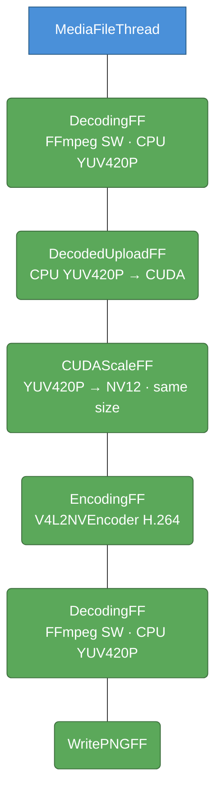
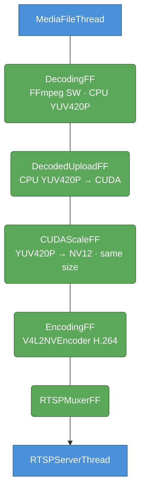
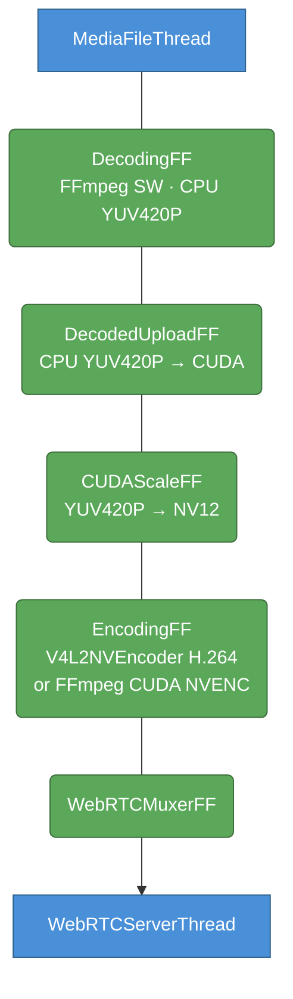
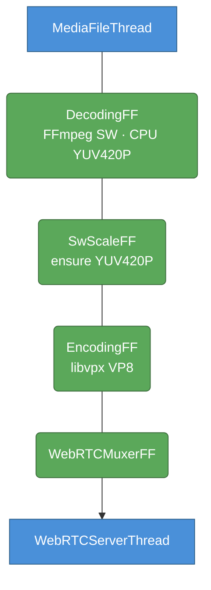

# Jetson Example Apps

Example pipelines for **NVIDIA Jetson** (Orin / Orin Nano / Orin NX) using
Argus CSI cameras, NVDEC hardware decoding, NVENC hardware encoding, and
CUDA-accelerated format conversion.

> [!NOTE]
> All examples require `nvargus-daemon` for CSI camera access:
> ```bash
> sudo systemctl start nvargus-daemon
> ```
> NVENC (`/dev/v4l2-nvenc`) is **not available on Orin Nano** — use `--codec vp8` or `--codec mjpeg` there.

## Purpose of these examples

These scripts are **incremental hardware validation tools**, not production
pipelines.  Each one isolates a specific hardware block:

| Script | What it exercises |
|--------|-------------------|
| `jetson_cam0.py` | Argus CSI capture → CPU path only |
| `jetson_cam1.py` | Argus CSI capture → CUDA path + GPU scale |
| `jetson_cam.py` | Argus CSI + GPU scale + SW or HW encode → RTSP |
| `jetson_decode0.py` | NVDEC hardware decode → CPU output (diagnostic) |
| `jetson_decode.py` | NVDEC hardware decode → GPU scale → SW encode → RTSP |
| `jetson_encode.py` | SW decode → CUDA upload → NVENC encode → SW decode verify |
| `jetson_rtsp.py` | SW decode → CUDA upload → NVENC encode → RTSP |
| `jetson_webrtc.py` | SW decode → [CUDA upload → NVENC \| SW VP8] → WebRTC → browser |

The reason they are split up is intentional: when debugging hardware codec
issues on Jetson it is much easier to have one moving part at a time.

**There is currently no single example that chains full hardware acceleration
end-to-end** (Argus CSI → NVDEC is not applicable since CSI bypasses the
compressed domain; the natural full-HW chain would be
`ArgusCameraThread [CUDA] → CUDAScaleFrameFilter → V4L2NVEncoder → RTSP`,
which is essentially `jetson_cam.py --codec v4l2` — but that requires a board
with NVENC enabled, which excludes Orin Nano).  The scripts covering each
building block are the intended stepping stones toward assembling such a
pipeline.

---

## jetson_cam0.py

*CSI camera diagnostic: frame-rate measurement and optional PNG dump*

Captures from an Argus CSI camera in CPU mode (pitch-linear NV12) and counts
frames.  Use this first to verify the camera is working and to discover sensor
modes.

```bash
python3 apps/python/jetson_cam0.py --list-modes
python3 apps/python/jetson_cam0.py --sensor-mode 4 --fps 30 --duration 10
python3 apps/python/jetson_cam0.py --sensor-mode 2 --png --duration 2
```

### Pipeline



---

## jetson_cam1.py

*CSI camera via CUDA path: capture → GPU scale → CPU download → optional PNG*

Captures frames directly into CUDA memory (EGL-mapped NV12), optionally resizes
on the GPU, then downloads to CPU.  Use `--width`/`--height` to scale; `0` keeps
the native sensor resolution.

```bash
python3 apps/python/jetson_cam1.py --list-modes
python3 apps/python/jetson_cam1.py --sensor-mode 4 --fps 30 --duration 10
python3 apps/python/jetson_cam1.py --sensor-mode 4 --width 640 --height 360 --png --duration 2
```

### Pipeline



---

## jetson_cam.py

*CSI camera → RTSP streaming with selectable encoder*

Full streaming pipeline from Argus CSI camera to RTSP.  Three encoder choices:

| `--codec` | Encoder | Input format | Notes |
|-----------|---------|--------------|-------|
| `vp8` (default) | FFmpeg libvpx SW | CPU YUV420P | High `--bitrate` = fastest ARM path |
| `mjpeg` | FFmpeg MJPEG SW | CPU YUV420P | All-intra; faster than VP8 on ARM |
| `v4l2` | V4L2 M2M HW H.264/H.265 | CPU NV12 | Requires NVENC; not on Orin Nano |

```bash
python3 apps/python/jetson_cam.py --list-modes
python3 apps/python/jetson_cam.py --sensor-mode 4 --width 640 --height 360 --fps 30 --codec vp8
python3 apps/python/jetson_cam.py --sensor-mode 4 --codec v4l2 --enc-codec h264
```

Connect: `ffplay rtsp://<jetson-ip>:8554/live/stream`

### Pipeline (vp8 / mjpeg)



### Pipeline (v4l2 H.264)



---

## jetson_decode0.py

*NVDEC diagnostic: file → hardware decode → PNG dump*

Decodes a video file using the Jetson V4L2 NVDEC hardware decoder and saves
frames as PNGs.  CPU output from NVDEC on Jetson uses **Block-Linear (GOB-tiled)
NV12** — frames will look visually corrupted (tiled pattern), but frame-to-frame
variation is still detectable, which is what this diagnostic checks.

```bash
python3 apps/python/jetson_decode0.py --file fixtures/video.mp4
python3 apps/python/jetson_decode0.py --file fixtures/video.mp4 --fps 5 --dir /tmp/pngs
```

### Pipeline



> **Note:** PNGs will look tiled/corrupt — that is expected with Block-Linear output.
> Frame-to-frame pixel variation confirms the decoder is producing distinct frames.

---

## jetson_decode.py

*File NVDEC → CUDA scale → VP8 → RTSP*

Decodes a video file with Jetson NVDEC (output directly into CUDA memory), scales
and converts NV12→YUV420P on the GPU in a single pass, re-encodes as VP8 software,
and serves via RTSP.

```bash
python3 apps/python/jetson_decode.py --file video.mp4 --width 1280 --height 720
```

Connect: `ffplay rtsp://<jetson-ip>:8554/live/stream`

### Pipeline



---

## jetson_encode.py

*Debug: SW decode → CUDA upload → V4L2NVEncode → SW decode back → PNG*

End-to-end encoder debug pipeline.  Decodes a file with FFmpeg SW decoder,
uploads to CUDA, converts YUV420P→NV12 on GPU, encodes with the Jetson V4L2
NVENC hardware encoder, then immediately decodes the H.264 output back with FFmpeg
SW decoder and saves PNG frames to verify round-trip correctness.

```bash
python3 apps/python/jetson_encode.py --file fixtures/video.mkv --secs 5
```

### Pipeline



---

## jetson_rtsp.py

*File → SW decode → CUDA upload → V4L2NVEncode → RTSP*

Production-style pipeline for Jetson Orin Nano.  Reads a media file, decodes with
FFmpeg SW decoder, uploads to CUDA, converts YUV420P→NV12 on GPU, encodes with
the Jetson V4L2 NVENC hardware encoder, and serves via RTSP.  No CSI camera
required — any local video file works as the source.

```bash
python3 apps/python/jetson_rtsp.py --file fixtures/video.mp4
python3 apps/python/jetson_rtsp.py --file fixtures/video.mp4 --loop 0 --bitrate 4000000
```

Connect: `ffplay rtsp://<jetson-ip>:8554/live/stream`

### Pipeline



---

## jetson_webrtc.py

*File → SW decode → selectable encode → WebRTC → browser*

Browser streaming companion to `jetson_rtsp.py`.  Reads a media file, decodes
with FFmpeg SW, and re-encodes with one of three backends before serving via
WebRTC.  nginx serves the player HTML on `--http-port`.

| `--encoder` | Backend | Codec | Notes |
|-------------|---------|-------|-------|
| `v4l2` (default) | Jetson V4L2 NVENC | H.264 Baseline/4.1 | Requires `/dev/v4l2-nvenc`; WebRTC-safe profile+level |
| `cuda` | FFmpeg CUDA NVENC | H.264 Baseline | Requires NVIDIA GPU |
| `sw` | FFmpeg libvpx | VP8 | Any host; no GPU needed |

```bash
python3 apps/python/jetson_webrtc.py --file fixtures/video.mp4
python3 apps/python/jetson_webrtc.py --file fixtures/video.mp4 --encoder v4l2 --loop
python3 apps/python/jetson_webrtc.py --file fixtures/video.mp4 --encoder cuda --bitrate 4000000
python3 apps/python/jetson_webrtc.py --file fixtures/video.mp4 --encoder sw
```

The startup banner prints ready-to-use browser URLs.  The frontend
(`webrtc_html_demo/static/index.html`) accepts a bare positional server spec so
you can open it from any machine and point it at the Jetson:

```
# served by this Jetson's nginx, opened remotely
http://myjetson:9091/?myjetson:9090&uuid=stream

# HTML served elsewhere, WebRTC stream from Jetson
http://laptop:9091/?myjetson:9090&uuid=stream
```

### V4L2 WebRTC encoder notes

H.264 from the Jetson V4L2 NVENC driver requires two explicit control calls that
the driver does not default correctly:

- `h264_profile = V4L2_MPEG_VIDEO_H264_PROFILE_BASELINE` — Firefox requires
  Constrained Baseline; the driver defaults to High.
- `h264_level = V4L2_MPEG_VIDEO_H264_LEVEL_4_1` — without this the driver
  emits `level_idc = 0` which produces an invalid `profile-level-id` in the
  WebRTC SDP offer and browsers reject it.

Both are set in `jetson_webrtc.py`; `extractH264Extradata()` in limef always
populates `codec_params_->extradata` regardless of `global_header` so the SDP
`sprop-parameter-sets` is always present.

### Pipeline (v4l2 / cuda)



### Pipeline (sw / VP8)



---

## Format conversion cheat-sheet

Key GPU-side conversions used across these examples:

| From | To | How |
|------|----|-----|
| NV12 CUDA | YUV420P CUDA | `CUDAScaleFrameFilter(output_format=AV_PIX_FMT_YUV420P)` |
| YUV420P CUDA | NV12 CUDA | `CUDAScaleFrameFilter()` (default NV12 output) |
| CPU YUV420P | CUDA YUV420P | `DecodedUploadFrameFilter` |
| CUDA NV12/YUV420P | CPU | `DecodedDownloadFrameFilter` |

> [!WARNING]
> `DecodedUploadFrameFilter` only accepts **NV12** and **YUV420P** as input.
> Feeding YUYV422 (raw USB camera output) directly will cause the filter to go
> defunct.  Prepend `SwScaleFrameFilter(AV_PIX_FMT_NV12)` to convert first.
